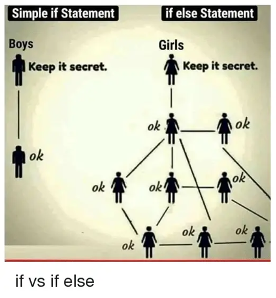

# Structures de contrôle de flux



## Cheatsheet
```python
"""
Les boucles `for` :
Utilisation pour répéter un bloc d'instructions un nombre défini de fois
"""
for i in range(5): # Boucle `for` sur une plage de nombres
    print(i) # Afficher les nombres de 0 à 4

for i in range(5, 10): # Boucle `for` sur une plage de nombres
    print(i) # Afficher les nombres de 5 à 9

for i in range(5, 10, 2): # Boucle `for` sur une plage de nombres
    print(i) # Afficher les nombres de 5 à 9 par pas de 2

for i in range(10, 5, -1): # Boucle `for` sur une plage de nombres
    print(i) # Afficher les nombres de 10 à 6

"""
Les boucles `while` :
Utilisation pour répéter un bloc d'instructions tant qu'une condition est vraie
"""
i = 0 # Initialisation d'une variable
while i < 5: # Boucle `while` tant que la condition est vraie
    print(i) # Afficher les nombres de 0 à 4
    i += 1 # Incrémenter la variable
    
    if i == 3: # Condition
        break # Arrêter la boucle

"""
Les conditions :
Utilisation pour exécuter un bloc d'instructions si une condition est vraie
"""
if 1 < 2: # Condition
    print("1 est inférieur à 2") # Afficher le message
elif 1 > 2: # Sinon si
    print("1 est supérieur à 2") # Afficher le message
else: # Sinon
    print("1 est égal à 2") # Afficher le message
```

## Partie 1 : Les boucles `for`
Les boucles `for` sont utilisées pour itérer sur une séquence (liste, tuple, ensemble, dictionnaire, etc.) et exécuter un bloc de code pour chaque élément de la séquence.

La syntaxe de base d'une boucle `for` en Python est la suivante :
- `element` : variable variable qui contiendra la valeur de l'élément de la séquence à chaque itération.
- `sequence` : séquence sur laquelle nous itérons.
```python
for element in sequence:
    # Code exécuté pour chaque élément de la séquence
    print(element)
```

### Itération sur une liste
```python
# Définir une liste
fruits = ["pomme", "banane", "orange"]

# Boucle `for` sur une liste
for fruit in fruits:
    print(fruit)
```

Résultat :
```
pomme
banane
orange
```

### Itération sur une chaîne de caractères
```python
# Définir une chaîne de caractères
phrase = "Bonjour !"

# Boucle `for` sur une chaîne de caractères
for lettre in phrase:
    print(lettre)
```

Résultat :
```
B
o
n
j
o
u
r

!
```

### Itération sur un dictionnaire
```python
# Définir un dictionnaire
personne = {
    "nom": "Dupont",
    "prenom": "Jean",
    "age": 25
}

# Boucle `for` sur un dictionnaire
for cle, valeur in personne.items():
    print(cle, valeur)
```

Résultat :
```
nom Dupont
prenom Jean
age 25
```

### Sortir d'une boucle `for`
```python
# Définir une liste
fruits = ["pomme", "banane", "orange"]

# Boucle `for` avec une condition de sortie
for fruit in fruits:
    if fruit == "banane":
        break
    print(fruit)
```

Résultat :
```
pomme
```

## Partie 2 : Les boucles `while`
Les boucles `while` sont utilisées pour exécuter un bloc de code tant qu'une condition est vraie.

La syntaxe de base d'une boucle `while` en Python est la suivante :
- `condition` : condition à vérifier à chaque itération.
```python
while condition:
    # Code exécuté tant que la condition est vraie
```

### Boucle `while` avec un compteur
```python
# Initialisation d'une variable
compteur = 0

# Boucle `while` avec un compteur
while compteur < 5:
    print(i)
    compteur += 1
```

Résultat :
```
0
1
2
3
4
```

### Boucle `while` avec une condition de sortie
```python
# Initialisation d'une variable
valeur = ""

# Boucle `while` avec une condition de sortie
while valeur != "q":
    valeur = input("Entrez une valeur (q pour quitter) : ")
    print("Vous avez entré la valeur", valeur)
```

Résultat :
```
Entrez une valeur (q pour quitter) : 1
Vous avez entré la valeur 1
Entrez une valeur (q pour quitter) : 2
Vous avez entré la valeur 2
Entrez une valeur (q pour quitter) : q
Vous avez entré la valeur q
```

### Boucle `while` avec une condition de sortie et une condition de saut
```python
# Initialisation d'une variable
valeur = ""

# Boucle `while` avec une condition de sortie et une condition de saut
while valeur != "q":
    valeur = input("Entrez une valeur (q pour quitter) : ")
    if valeur == "q":
        break
    print("Vous avez entré la valeur", valeur)
```

Résultat :
```
Entrez une valeur (q pour quitter) : 1
Vous avez entré la valeur 1
Entrez une valeur (q pour quitter) : 2
Vous avez entré la valeur 2
Entrez une valeur (q pour quitter) : q
```

## Partie 3 : Les structures conditionnelles
Les structures conditionnelles sont utilisées pour exécuter des blocs de code en fonction de l'évaluation d'une ou plusieurs conditions. En Python, les structures conditionnelles sont gérées avec les instructions `if`, `elif` et `else`.

### L'instruction `if`
L'instruction `if` permet d'exécuter un bloc de code si une condition est vraie. Voici la syntaxe de base :
```python
if condition:
    # Code exécuté si la condition est vraie
```

La condition peut être une expression qui évalue à `True` ou `False`. Si la condition est `True`, le code indenté sous l'instruction `if` sera exécuté.

### L'instruction `else`
L'instruction `else` est utilisée pour exécuter un bloc de code lorsque la condition dans l'instruction `if` est fausse. Voici la syntaxe de base :
```python
if condition:
    # Code exécuté si la condition est vraie
else:
    # Code exécuté si la condition est fausse
```

Si la condition dans l'instruction `if` est fausse, le code indenté sous l'instruction `else` sera exécuté.

### L'instruction `elif`
L'instruction `elif` est utilisée pour tester plusieurs conditions. Elle est placée après l'instruction `if` et avant l'instruction `else`. Voici la syntaxe de base :
```python
if condition1:
    # Code exécuté si la condition1 est vraie
elif condition2:
    # Code exécuté si la condition2 est vraie
elif condition3:
    # Code exécuté si la condition3 est vraie
else:
    # Code exécuté si aucune condition n'est vraie
```

Si la condition1 est vraie, le code indenté sous l'instruction `if` sera exécuté. Si la condition1 est fausse et que la condition2 est vraie, le code indenté sous la première instruction `elif` sera exécuté. Si la condition1 et condition2 sont fausses et que la condition3 est vraie, le code indenté sous la deuxième instruction `elif` sera exécuté. Si aucune des conditions n'est vraie, le code indenté sous l'instruction `else` sera exécuté.

### Les opérateurs de comparaison en Python
Les opérateurs de comparaison sont utilisés pour évaluer des expressions et retourner un booléen (`True` ou `False`). Voici une liste des opérateurs de comparaison les plus courants en Python :

| Opérateur | Description | Exemple |
| --------- | ----------- | ------- |
| `<` | Inférieur à | `2 < 3 = True` |
| `>` | Supérieur à | `2 > 3 = False` |
| `==` | Égal à | `2 == 3 = False` |
| `<=` | Inférieur ou égal à | `2 <= 3 = True` |
| `>=` | Supérieur ou égal à | `2 >= 3 = False` |
| `!=` | Différent de | `2 != 3 = True` |

Exemple :
```python
# Définir une variable
age = 25

# Utiliser les opérateurs de comparaison
if age < 18:
    print("Vous êtes mineur")
elif age >= 18 and age < 65:
    print("Vous êtes majeur")
else:
    print("Vous êtes retraité")
```

### Les opérateurs logiques en Python
Les opérateurs logiques sont utilisés pour combiner deux valeurs booléennes et renvoyer un booléen (`True` ou `False`). Les opérateurs logiques courants en Python sont :

| Opérateur | Description | Exemple |
| --------- | ----------- | ------- |
| `and` | ET | `True and True = True` |
| `or` | OU | `True or False = True` |
| `not` | NON | `not True = False` |

Exemple :
```python
# Définir une variable
age = 25

# Utiliser les opérateurs logiques
if age >= 18 and age < 65:
    print("Vous êtes majeur")
```

## Partie 4 : Exercices

### Exercice 1 : Calculatrice
>Ecrire un programme Python qui demande à l'utilisateur d'entrer un nombre et de choisir un mode de calcul parmi l'addition, la soustraction, la multiplication et la division. Ensuite, le programme demande à l'utilisateur un deuxième nombre et affiche le résultat de l'opération sélectionnée.

[Solution](./exercices/01.py)

### Exercice 2 : Palindrome
>Ecrire un programme Python qui demande à l'utilisateur de saisir une chaîne de caractères. Le programme doit vérifier si la chaîne est un palindrome (c'est-à-dire si elle peut être lue de la même façon de gauche à droite et de droite à gauche). Si la chaîne est un palindrome, le programme doit afficher un message de confirmation. Sinon, le programme doit afficher un message d'erreur.

[Solution](./exercices/02.py)

### Exercice 3 : Jeu du nombre mystère
>Ecrire un programme Python qui génère un nombre aléatoire entre 1 et 100.
```python
import random
nombre = random.randint(1, 100)
```
>Ensuite, le programme demande à l'utilisateur de deviner le nombre. Si l'utilisateur devine le nombre correctement, le programme affiche un message de félicitations. Sinon, le programme donne des indices pour aider l'utilisateur à deviner le nombre (plus grand ou plus petit que le nombre choisi). Le programme doit continuer à demander des réponses à l'utilisateur jusqu'à ce qu'il devine correctement. Le nombre de tentatives doit être affiché à la fin du jeu.

[Solution](./exercices/03.py)
