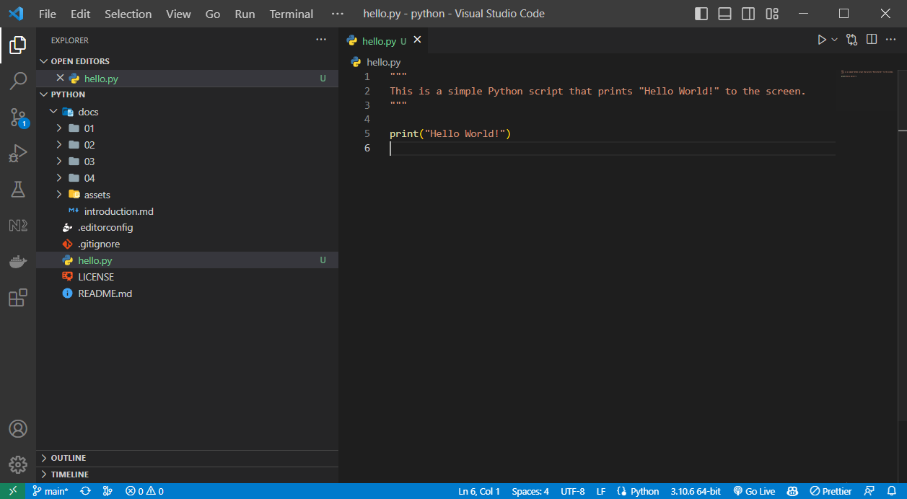

# Introduction au Python
{: .no_toc }


## Table of contents
{: .no_toc .text-delta }

1. TOC
{:toc}

---

## Présentation de Python

### Qu'est-ce que Python ?
Python est un langage de programmation interprété, orienté objet et facile à lire et écrire. Il est souvent utilisé pour le développement de logiciels, de sites web, d'outils d'analyse de données et d'intelligence artificielle.

### Pourquoi Python est-il un langage de programmation populaire ?
Python est populaire pour plusieurs raisons :
- Il est facile à apprendre et à comprendre
- Il a une syntaxe claire et concise
- Il est utilisé dans de nombreuses industries, notamment la science des données, l'intelligence artificielle et le développement web
- Il possède une large communauté d'utilisateurs qui fournissent des bibliothèques et des modules utiles

### Applications courantes de Python
Python est utilisé dans de nombreuses industries, notamment :
- La science des données et l'analyse de données
- L'intelligence artificielle et l'apprentissage automatique
- Le développement web et les applications de bureau
- L'automatisation de tâches et de processus

### Présentation de la syntaxe Python
La syntaxe Python est simple et facile à lire. Les instructions sont séparées par des sauts de ligne et l'indentation est importante pour définir les blocs de code. Python utilise également des bibliothèques et des modules pour ajouter des fonctionnalités et des capacités supplémentaires.

```python
# Ceci est un commentaire simple

"""
Ceci est un commentaire multiligne !
Les commentaires simples et multilignes sont ignorés par l'interpréteur Python.
"""

# Afficher un message à l'écran
print("Hello World!")

# Déclarer une variable
x = 5

# Déclarer une fonction
def ma_fonction():
    # L'indentation est importante pour définir les blocs de code
    # 4 espaces ou 1 tabulation sont généralement utilisés pour l'indentation
    print("Ceci est une fonction")

# Multiligne avec antislash
x = 1 + 2 + 3 + \
    4 + 5 + 6 + \
    7 + 8 + 9

# Multiligne avec parenthèses
x = (1 + 2 + 3 +
     4 + 5 + 6 +
     7 + 8 + 9)
```

## Installation de Python et VS Code

### Installation de Python sur Windows
- Allez sur le site officiel de Python : [https://www.python.org/downloads](https://www.python.org/downloads)
- Téléchargez la dernière version de Python pour Windows
- Exécutez le programme d'installation et suivez les instructions à l'écran

### Installation de VS Code sur Windows
- Allez sur le site officiel de VS Code : [https://code.visualstudio.com/download](https://code.visualstudio.com/download)
- Téléchargez la dernière version de VS Code pour Windows
- Exécutez le programme d'installation et suivez les instructions à l'écran

### Configuration d'un environnement de développement Python avec VS Code
- Ouvrez VS Code
- Installez l'extension Python pour VS Code
- Créez un nouveau dossier pour vos projets Python
- Créez un nouveau fichier Python (.py) dans ce dossier
- Ajoutez votre code Python dans ce fichier



## Utilisation de GitHub
GitHub est un service web qui permet de stocker des dépôts (repositories) de code source. GitHub est utilisé par de nombreux développeurs pour stocker et partager leur code source.

### Création d'un compte GitHub
- Allez sur le site officiel de GitHub : [https://github.com](https://github.com)
- Créez un compte GitHub en suivant les instructions à l'écran

### Création d'un dépôt GitHub
Un dépôt GitHub (ou **repository**) est un endroit où vous pouvez stocker votre code source. Vous pouvez créer un dépôt GitHub pour stocker vos projets personnels ou pour partager votre code source avec d'autres développeurs.
- Connectez-vous à votre compte GitHub
- Cliquez sur le bouton "New" en haut à droite de la page
- Entrez un nom pour votre dépôt
- Entrez une description pour votre dépôt
- Sélectionnez "Public" ou "Private" pour le type de dépôt
- Cliquez sur le bouton "Create repository"

### Forker un dépôt GitHub
Forker un dépôt GitHub est une opération qui permet de créer une copie d'un dépôt GitHub dans votre propre compte GitHub. Cela vous permet de modifier le code source du dépôt original sans affecter le dépôt original.
- Allez sur le dépôt GitHub que vous souhaitez forker (par exemple : [https://github.com/rodolphebarbanneau/python](https://github.com/rodolphebarbanneau/python))
- Cliquez sur le bouton "Fork" en haut à droite de la page
- Choisissez votre compte GitHub comme destination du fork

### Cloner un dépôt GitHub
Cloner un dépôt GitHub est une opération qui permet de télécharger le code source d'un dépôt GitHub sur votre ordinateur :
- Connectez-vous à votre compte GitHub
- Allez sur le dépôt GitHub que vous souhaitez cloner
- Cliquez sur le bouton "Code" en haut à droite de la page
- Clônez le dépôt avec plusieurs méthodes :
    - Avec **HTTPS**
        - Copiez l'URL du dépôt
        - Ouvrez un terminal (cmd.exe) et exécutez la commande suivante : `git clone [url-du-depot]`
    - Avec **GitHub Desktop**
        - Installez GitHub Desktop : [https://desktop.github.com](https://desktop.github.com)
        - Ouvrez GitHub Desktop et connectez-vous à votre compte GitHub
        - Cliquez sur le bouton "Clone a repository from the Internet..."
        - Sélectionnez le dépôt que vous souhaitez cloner
        - Choisissez l'emplacement où vous souhaitez cloner le dépôt
        - Cliquez sur le bouton "Clone"

### Syncroniser un dépôt GitHub avec VS Code
Vous pouvez utiliser VS Code pour modifier le code source d'un dépôt GitHub. Pour ce faire, vous devez cloner le dépôt GitHub sur votre ordinateur et ouvrir le dossier du dépôt dans VS Code.
- Cloner le dépôt GitHub sur votre ordinateur
- Ouvrez le dossier du dépôt dans VS Code
- Modifiez le code source du dépôt
- Synchronisez le dépôt avec GitHub en utilisant l'options "Source Control" de VS Code

### Commiter et pusher des modifications sur GitHub
Commiter et pusher des modifications sur GitHub est une opération qui permet de sauvegarder vos modifications sur le dépôt GitHub.
- Modifiez le code source du dépôt
- Ouvrez l'onglet "Source Control" de VS Code
- Cliquez sur le bouton "+" pour ajouter les fichiers modifiés au commit
- Entrez un message de commit
- Cliquez sur le bouton "Commit" pour commiter les modifications
- Cliquez sur le bouton "Push" pour pusher les modifications sur GitHub

## Ressources supplémentaires

Sites web utiles pour apprendre Python :
- [https://www.python.org](https://www.python.org)
- [https://docs.python.org/3/tutorial](https://docs.python.org/3/tutorial)
- [https://realpython.com](https://realpython.com)
- [https://stackoverflow.com/questions/tagged/python](https://stackoverflow.com/questions/tagged/python)

Livres recommandés sur Python :
- "Learning Python" de Mark Lutz
- "Python Crash Course" d'Eric Matthes
- "Python for Data Analysis" de Wes McKinney
